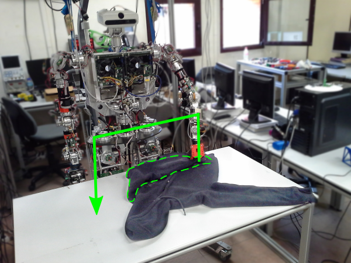

Towards Robotic Clothes Folding: A Garmente-Agnostic Unfolding Algorithm
--------

Author: [David Estevez](https://github.com/David-Estevez)

Tutor: [Juan G Victores](https://github.com/jgvictores)

Director: Carlos Balaguer

## Abstract
Current approaches for robotic garment folding require a full view of an extended garment, in order to successfully apply a model-based folding sequence. In this thesis we present a garment-agnostic algorithm that requires no model to unfold clothes and works using a single view from an RGB-D sensor. Once the garment is unfolded, state of the art approaches for folding may be applied.

The algorithm presented is divided into 3 main stages. First, a Segmentation stage extracts the garment data from the background, and approximates its contour into a polygon. Then, a Clustering stage groups similar-height regions of the garment corresponding to different overlapped regions. Finally, a Pick and Place Points stage finds the most suitable points for grasping and releasing the garment for the unfolding process, based on a bumpiness value defined as the accumulated difference in height along selected candidate paths.

Experiments for evaluation of the algorithm have been performed over a dataset of 120 samples from a total of 6 different garment categories with one and two folds. Results have been analyzed, and present high scores for each of the stages that compose the algorithm. The unfolding algorithm also has been validated through experiments with a humanoid robot platform.

## Abstract (Spanish)
En la actualidad, los métodos para el doblado automático de ropa usando robots requieren una vista completa de la prenda extendida, para su clasificación y posterior doblado basada en un modelo de la categoría a la que pertenece la prenda. En esta tesis, se presenta un algoritmo independiente del tipo de prenda que no requiere de un modelo previo para desdoblar ropa y que está basado en el uso de una única vista obtenida con un sensor RGB-D. Una vez desdoblada, se puede aplicar para su doblado cualquier algoritmo ya existente.

El algoritmo presentado en este trabajo está divido en 3 etapas principales. Primero, una Etapa de Segmentación separa la información de la prenda de la del fondo, y aproxima su contorno a un polígono. Después, una Etapa de Agrupación encuentra regiones de altura similar en la prenda, correspondientes a las distintas partes solapadas. Finalmente, una Etapa de Puntos de Agarre y Posicionamiento encuentra los puntos más adecuados para sujetar y soltar la prenda durante el proceso de desdoble, basados en un valor de agrura, definido como la diferencia de alturas acumulada a lo largo de las trayectorias de desdoble candidatas.

La evaluación del algoritmo se llevó a cabo a través de experimentos con un conjunto de datos que comprende 120 muestras de 6 categorías de prenda distintas, con uno y dos dobleces. Los resultados fueron analizados, y presenta puntuaciones altas para cada una de las etapas que componen el algoritmo. El algoritmo de desdoble ha sido validado también a través de experimentos llevados a cabo con un robot humanoide.

## Algorithm implementation

The implementation of the work of this thesis has been released as Free Software (free as in freedom), and can be found in [this repository](https://github.com/roboticslab-uc3m/textiles) along with later developments.

## If you want to generate the document yourself...

Requirements:

* To solve problems with apacite.sty missing:
    
        $ sudo apt-get install texlive-bibtex-extra

* To solve problems with xcolor missing:
    
        $ sudo apt-get install latex-xcolor
